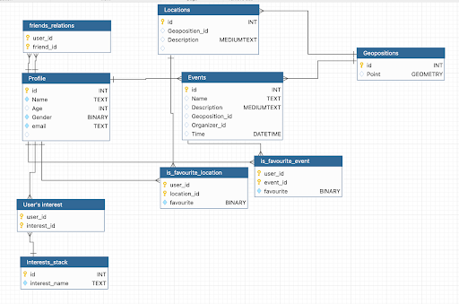

# Project Overview

## Introduction

This project is a **multiplatform event discovery application for Cyprus** that helps users find, explore, and manage local events through an interactive map-based interface. The platform enables users to discover nearby events, filter them by time and interests, save favorites, and interact with other users.

The system is built using a **modern full-stack architecture**:

- **Backend:** Kotlin with Ktor
- **Frontend:** React with TypeScript
- **Database:** Firebase Firestore
- **Platform:** Mobile and Web compatible interface

The application focuses on **location-based event discovery**, allowing users to browse events visually on a map while also viewing them in list format.

---

## System Architecture

The project follows a **client-server architecture**:

Frontend (React + TypeScript)
│
│ REST API
▼
Backend (Kotlin + Ktor)
│
│ Firebase SDK
▼
Firebase Firestore

### Backend (Kotlin + Ktor)

The backend is implemented using **Ktor**, a lightweight asynchronous framework for building APIs in Kotlin.

Responsibilities include:

- User authentication
- Event management
- Location queries
- Favorites management
- User profiles and interests
- Friend relationships
- Communication with Firebase Firestore

The backend exposes **REST endpoints** that the frontend consumes.

---

### Frontend (React + TypeScript)

The frontend provides a **responsive user interface** that allows users to interact with the platform.

Key UI technologies:

- React
- TypeScript
- Map-based visualization
- Mobile-first UI design

The interface focuses on **event exploration and filtering**, integrating maps, lists, and personalized recommendations.

---

### Database (Firebase Firestore)

The application uses **Firebase Firestore** as its primary data store.

Firestore was chosen for:

- Real-time data updates
- Scalability
- Easy integration with mobile applications
- Flexible document-based structure

---

## Core Features

- Location-based event discovery
- Interactive map with event markers
- Event search and filtering by date and interests
- Favorite events and locations
- User profile management
- User interest selection
- Friend relationships between users
- Event preview and navigation routes
- Event list view
- Map-based exploration interface

---

## Application Screens

- Authentication (Sign in / Sign up)
- Dashboard
- Event discovery (Find events)
- Event list view
- Map view with event markers
- Favorites
- Event history
- User profile
- Interest editing
- Friend list

---

## Database Design

The following diagram illustrates the relational structure used to model users, events, locations, interests, and relationships within the application.

---

## Map Integration

Map functionality allows users to:

- View nearby events
- Navigate to event locations
- Filter events by area
- Open event details directly from map markers

Each event contains **geospatial coordinates** used to render markers on the map.

---

## Scalability Considerations

The system is designed to scale using:

- Firebase Firestore distributed storage
- Stateless Ktor backend services
- Modular frontend architecture

Future improvements may include:

- real-time event updates
- push notifications
- recommendation systems
- event hosting tools

---

## Conclusion

This platform aims to simplify **event discovery in Cyprus** by combining:

- location-based services
- personalized interests
- social features
- modern cross-platform architecture

The combination of **Kotlin/Ktor backend, React/TypeScript frontend, and Firebase Firestore** provides a scalable and flexible foundation for expanding the platform in the future.